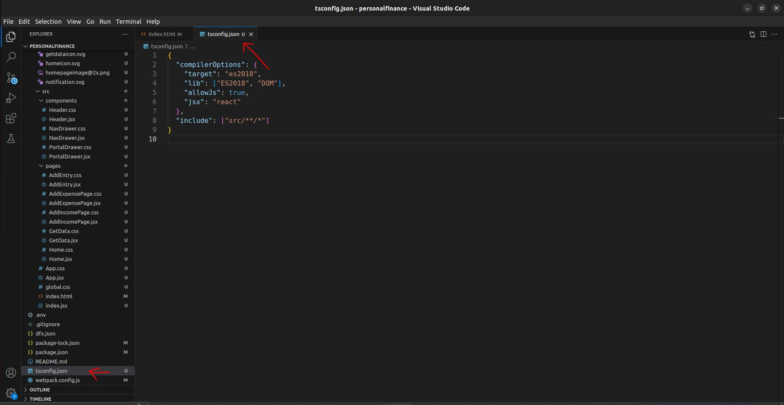

# Creating a Personal Finance Tracker Dapp on the Internet Computer (ICP)

In this tutorial, we will guide you through the process of creating a Personal Finance Tracker decentralized application (Dapp) on the Internet Computer (ICP). The Dapp will consist of both a backend written in Motoko and a frontend using React.

**Prerequisites:**

Before we begin, make sure you have the following installed and set up:

1. **DFX (Internet Computer Development Kit):** Follow the [DFX installation tutorial](https://docs.google.com/document/d/1wGVVqlXZE8rzlLQOl4P4CkUP9dCVqIGc8iLTBthwinc/edit?usp=sharing) to set up DFX for development.

## Step 1: Create a New Project

First, create a new project using the following commands:

```shell
dfx new personalfinance
cd personalfinance
```

Now open the folder in VS Code
You will get followed folder structure


## Step 2: Set Up the Backend

Replace the existing Motoko code in main.mo file present in personalfinancetracker_backend folder with the provided Motoko code. This code defines the backend logic for managing income, expenses, and user balances.

```javascript
import Array "mo:base/Array";
import Buffer "mo:base/Buffer";
import Nat "mo:base/Nat";
import Text "mo:base/Text";
actor {

  // Define data types for Income and Expense
  type Income = {
    amount : Nat;
    description : Text;
    source : Text;
  };

  type Expense = {
    amount : Nat;
    description : Text;
    category : Text;
  };

  var balance = 0;
  let incomeBuffer = Buffer.Buffer<Income>(0);

  var expense = 0;
  let expenseBuffer = Buffer.Buffer<Expense>(0);

  public func addIncome(amount : Nat, inputInfo : Text, source : Text) : async Nat {
    let newIncome : Income = {
      amount = amount;
      description = inputInfo;
      source = source;
    };
    incomeBuffer.add(newIncome);
    balance := balance + amount;
    return balance;
  };

  public func addExpense(cost : Nat, purchaseInfo : Text, category : Text) : async Nat {
    let newExpense : Expense = {
      amount = cost;
      description = purchaseInfo;
      category = category;
    };

    expenseBuffer.add(newExpense);
    expense := expense + cost;
    return expense;
  };

  public query func getBalance() : async Nat {
    return balance;
  };

  public query func getExpense() : async Nat {
    return expense;
  };

  public query func getListOfIncomes() : async [Income] {
    return Buffer.toArray(incomeBuffer);
  };

  public query func getListOfExpenses() : async [Expense] {
    return Buffer.toArray(expenseBuffer);
  };
};

```

## Step 3: Set Up the Frontend

Download the frontend files from this [link](http://sirilux.in/wp-content/uploads/2023/10/download1.zip), unzip it & replace the existing files in the personalfinance_frontend folder. (i.e. Delete every folder & file under personalfinance_frontend folder and copy paste the downloaded file)

You should have following updated folder structure


## Step 4: Configure the Project for React Frontend

To configure your project for React frontend, follow these steps:

you can learn more about this [here](https://internetcomputer.org/docs/current/developer-docs/frontend/custom-frontend)

1. Install the required dependencies:

```shell
npm install --save react react-dom react-router-dom
npm install --save-dev typescript ts-loader
npm install --save-dev style-loader css-loader
```


2.  Open the webpack.config.js file and make the following modifications:

- Replace the frontend entry to use index.jsx instead of index.js

```javascript
entry: {
  index: path.join(__dirname, frontend_entry).replace(/\.html$/, ".jsx"),
},
```


- Uncomment the module configuration to include TypeScript and CSS loaders.

```javascript
module: {
  rules: [
    { test: /\.(js|ts)x?$/, loader: "ts-loader" },
    { test: /\.css$/, use: ['style-loader', 'css-loader'] }
  ]
},
```


- Create a tsconfig.json file in your project's root directory and add the following configuration:

```javascript
{
  "compilerOptions": {
    "target": "es2018",
    "lib": ["ES2018", "DOM"],
    "allowJs": true,
    "jsx": "react"
  },
  "include": ["src/**/*"]
}
```



## Step 5: Deploy Your Dapp

!!! Full app will not be deployed !!!

Deploy both the frontend and backend with the following command:

```shell
    dfx start --background --clean
    dfx deploy
```

You can now interact with the frontend and backend "separately".

## Step 6: Connect Frontend and Backend

Install the dependencies required to display lists of expenses and income using @tanstack/react-table.

```shell
npm install @tanstack/react-table
```

Now download full frontend code with backend integration done from [here](http://sirilux.in/wp-content/uploads/2023/10/download2.zip)

- Open AddIncomePage.jsx of your existing files and compare it with the downloaded AddIncomePage.jsx to see the differences.


- Update the differences accordingly
- Repeat the same process for

  1. AddExpensePage.jsx
  2. GetData.jsx
  3. GetData.css

Now, you are ready to deploy your full-stack Dapp on the Internet Computer and start managing your personal finances.

```shell
    dfx start --background --clean
    dfx deploy
```

By following these steps, you will have a fully functional Dapp for tracking personal finances on the Internet Computer.
